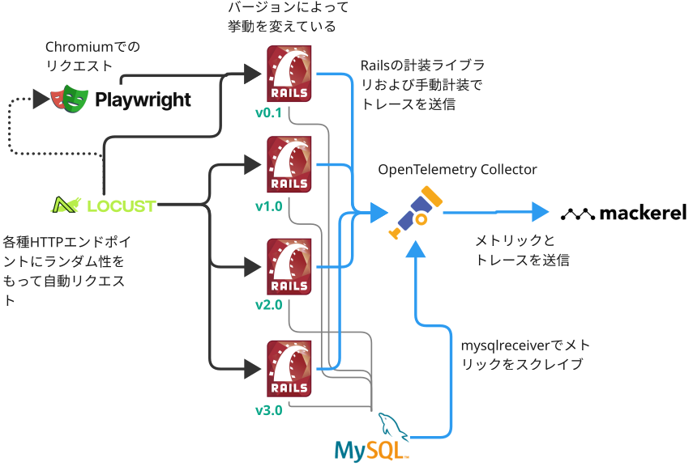

# APMデモアプリケーション

このリポジトリは、OpenTelemetry対応のAPMデモアプリケーションを提供します。

デフォルトでは[Mackerel](https://ja.mackerel.io)にトレースおよびメトリックを投稿するように設定されていますが、設定で簡単に別のOpenTelemetry対応のツールに投稿することもできます。

## どのようなデモを提供するか

架空の商品カタログのWebアプリケーションがデモの題材です。


アプリケーションは挙動の異なる複数のバージョンを動かしています。リクエスト先のアプリケーションバージョンやリクエストエンドポイントによって、「遅い」「エラーが発生する」といった問題が起こるようになっています。

人間が都度実行するのではなく、自動で動かしっぱなしにするデモを想定しています。そのため、複数のロボットが人間のようにブラウザを利用してリクエストを実行します。

> [!NOTE]
> ロボットがアクセスすることを前提としているため、実際にはフロントエンドのビューはほぼ用意しておらず、一部を除いてエンドポイントからのレスポンスはJSON形式です。このデモの範囲において、レスポンスの内容はさほど重要ではありません。



各アプリケーションバージョンの挙動は以下のとおりです。

- **v0.1**：`/products`エンドポイントへのアクセスを受けると3秒後にエラー（例外）が発生します
- **v1.0**：`/products`エンドポイントにN+1問題があり、リクエストのたびに大量のクエリが発行されます
- **v2.0**：`/products`エンドポイントのN+1問題を解決したバージョンです
- **v3.0**：N+1問題をさらにスマートにしたバージョンです。しかしそれとは別に、`/products/{:id}`のエンドポイントの一部のIDでエラー（例外）が発生します

## 設定

Mackerelのオーガニゼーションを用意します。プランはTrial/Free/Standardを問いません。Standardの場合、無料枠を超えた場合は課金対象になることに注意してください（Trial・Freeの場合は無料枠に到達した場合は当月はそれ以上のトレース スパン投稿はできなくなります。[詳細](https://ja.mackerel.io/pricing)）。

オーガニゼーションのAPIキー（Write権限あり）を`env.txt`の`MACKEREL_APIKEY=`の後に記述し、保存します。

> [!NOTE]
> `env.txt`の`USE_SERVICE_VERSION_AS_ENVIRONMENT_NAME`はバージョン文字列を`deployment.environment.name`に入れる（`true`）か、`service.version`に入れる（`false`）かを設定します。

## 実行

Linux上のDocker環境を想定しています（最低2GB以上のメモリ）。macOSでも動作することを確認していますが、hostmetrics receiverやDocker Stats receiverをカスタマイズして利用するにはLinux OSである必要があります。

最初にイメージをビルドします（初回のみ）。

```
docker compose build
```

クリーニング・データベースの初期化・起動の一連の実行を`run.sh`スクリプトにまとめているので、それを実行します。

```
./run.sh
```

終了するには以下を実行します。

```
./run.sh clean
```

> [!NOTE]
> systemdで自動起動化するサービス定義の例を`apm-demo.service.sample`に用意しています。

投稿できているかどうかはMackerelのAPM画面や、OpenTelemetry Collectorのログで確認します。

```
docker compose logs otel-collector -f
```

## 送られるシグナル
### トレース

- `sample-app`（`apm-demo`ネームスペース）
  - Ruby on Railsアプリケーションのトレースが含まれます。

### メトリック

- `sample-app`（`apm-demo`ネームスペース）
  - ホストリソースメトリック、MySQLメトリック、スパンメトリックが含まれます（53個）。
- `otelcol-contrib`（`apm-demo`ネームスペース）
  - OpenTelemetry Collector自身の内部メトリックです（29個）。

## カスタマイズ

### ほかのOpenTelemetryツールに書き出す

利用したいツールのドキュメントを参照し、`otel-collector-config.yaml`を編集してください。

```
exporters:
  ...
  otlphttp/アプリケーション名: ←HTTP/Protobufの場合。gRPCであればotlp/アプリケーション名
    endpoint: https://… ←エンドポイントURI。必要に応じて以下ヘッダなどを指定

service:
  pipelines:
    traces:
      ...
      exporters: [debug, otlphttp/アプリケーション名, spanmetrics]
    metrics:
      ...
      exporters: [debug, otlphttp/アプリケーション名]
```

## 権利表記

```
Copyright 2025 Hatena Co., Ltd.

Licensed under the Apache License, Version 2.0 (the "License");
you may not use this file except in compliance with the License.
You may obtain a copy of the License at

    http://www.apache.org/licenses/LICENSE-2.0

Unless required by applicable law or agreed to in writing, software
distributed under the License is distributed on an "AS IS" BASIS,
WITHOUT WARRANTIES OR CONDITIONS OF ANY KIND, either express or implied.
See the License for the specific language governing permissions and
limitations under the License.
```
